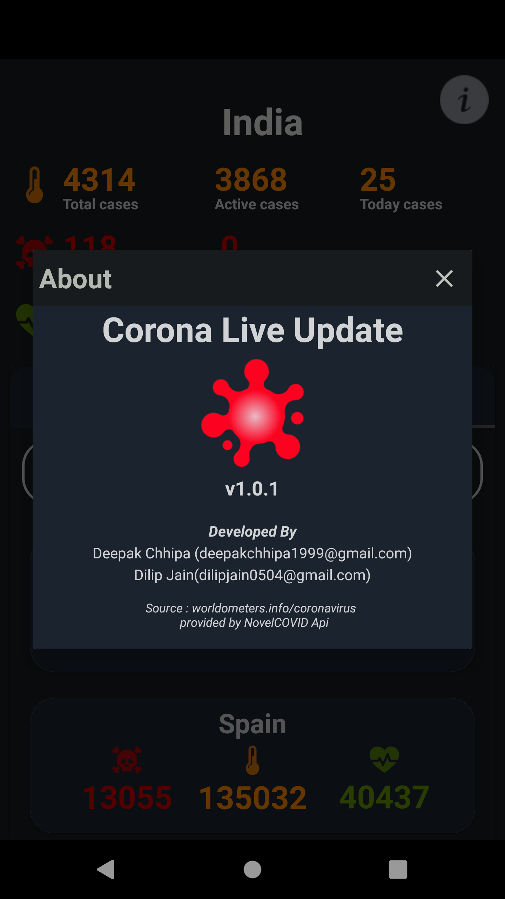

# Covid-19 Android App


Corona Live Update is a mobile application that provides updated stats and data about the spreaded corona virus around the world,  it is a Android app to track the spread of novel Corona Virus (COVID-19) in near-realtime.

The mobile application shows also, the total cases in the globe, and a detailed report about every country -sorted by the number of confirmed cases with the pie chart.

Thanks to the reports and data provided by [worldmeters](https://www.worldometers.info/coronavirus/) and NovalCOVID API, the application simplifies and provide data about the spreading of the corona virus in the local region of the users, reports such as : how many active cases, new daily confirmed cases, new deaths and how many recovered one.


## [Download The App from here ](https://github.com/islem19/CoronaCovid19/releases/download/v1.0.1/covid19.apk)

## Screenshots

[](screenshots/screenshot1.png)
[](screenshots/screenshot2.png)
[](screenshots/screenshot3.png)
[](screenshots/screenshot4.png)


## How to use it?
Clone this repository and import into **Android Studio**
```bash
git clone https://github.com/islem19/CoronaCovid19.git
```

## Permissions
The App requires the following permissions:
- Internet access.

##Tech Specification
- [Retrofit](https://square.github.io/retrofit/)
- [Intuit/sdp](https://github.com/intuit/sdp)
- [MPAndroidChart](https://github.com/PhilJay/MPAndroidChart)
- [CardView]()
- [Gson](https://github.com/google/gson)
- [Butterknife](https://jakewharton.github.io/butterknife/)
- [RecyclerView](https://developer.android.com/jetpack/androidx/releases/recyclerview)
- [Material Design](https://material.io/develop/android/components/)


### Contributing
Just make pull request. You are in!